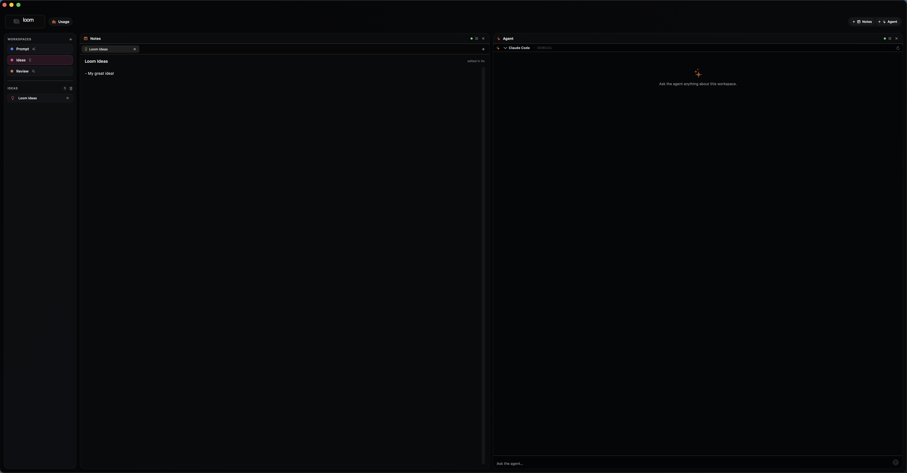
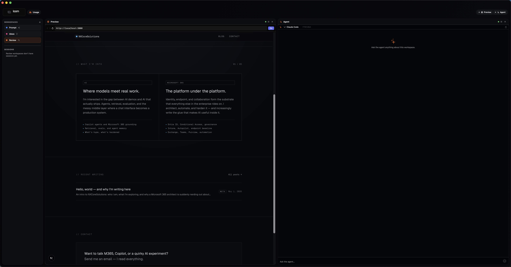

# Loom

Native workspace app for terminals, editor, AI agents, and task state in one window. The terminal is the differentiator.

Two builds live in this repo:

- **macOS** (this README): SwiftUI + SwiftData, ships as a `.dmg` to `/Applications/Loom.app`. Source under `Loom/`.
- **Windows** (`windows-tauri/`): Tauri 2 + Rust + React, ships as MSI/NSIS for both `aarch64-pc-windows-msvc` and `x86_64-pc-windows-msvc`. See [`windows-tauri/README.md`](./windows-tauri/README.md) and [`windows-tauri/TESTING.md`](./windows-tauri/TESTING.md).

Loom is a personal, single-user tool. No subscription model, hosted control plane, team billing, or feature gating. Local-first storage is the default; cloud services should be optional provider integrations only when they directly help the operator ship.






## Install

Grab the latest `.dmg` from [Releases](https://github.com/BigBeardedMan/Loom/releases/latest), open it, and drag **Loom** to Applications. macOS 14+.

The build is ad-hoc signed (no Apple Developer ID), so on first launch right-click **Loom → Open** to bypass Gatekeeper's one-time prompt. Subsequent launches behave normally.

Loom auto-checks GitHub Releases every 60 seconds. When a newer build is available, the **Update** pill in the top bar lights up. Click it to swap in the new version.

## Build from source

```bash
brew install xcodegen          # one-time
cd path/to/Loom                # your local clone
xcodegen generate              # regenerate Loom.xcodeproj after editing project.yml
open Loom.xcodeproj
```

Then build & run from Xcode (⌘R). macOS 14+.

## Cutting a release

```bash
# 1. Bump MARKETING_VERSION (and CURRENT_PROJECT_VERSION) in project.yml
# 2. Commit + push
bin/release.sh                 # run from the repo root
```

`release.sh` regenerates the project, builds Release, packages a `.dmg`, tags `vX.Y.Z`, pushes the tag, and creates a GitHub release with the `.dmg` attached. Running Loom installs everywhere pick the new build up automatically.

## Docs

- **Single-page reference:** [GUIDE.md](./GUIDE.md). Every feature, every setting, every file path, every keyboard shortcut. Has a table of contents at the top.
- **Hosted MkDocs site:** [bigbeardedman.github.io/Loom](https://bigbeardedman.github.io/Loom/). Same chapters, navigable per-page.

## Status

`v3.0.0`. Four-pane cockpit, SwiftTerm-backed terminal with **multi-row click-to-position inside CLI agent prompts**, Anthropic + Claude Code agents, **local LLMs (Ollama + OpenAI-compatible)**, MkDocs docs site at [bigbeardedman.github.io/Loom](https://bigbeardedman.github.io/Loom/), SwiftData task board with task-to-agent / task-to-terminal handoff, and over-the-air updates from GitHub Releases with **SHA-256 verified DMGs** (auto-update refuses to install a release without a published checksum sidecar). **Stable local code signing** so granted folder permissions persist across rebuilds, and a **giant throbber on the Usage view** while year-range snapshots compute. v1.4.0 landed a security/correctness pass: hardened Keychain access flags, stripped credential env vars on PTY spawn, an arguments-array `claude` invocation (no shell), terminated-process cancel that actually unblocks, and off-main-thread tasks/usage/layout writes. v1.5.0 added rolling usage windows and dashboard analytics. v1.6.0 split Usage into per-CLI dashboard tabs. v1.7.0 added Codex and Gemini CLI support. v1.7.1 is a re-release of v1.7.0 to trigger the auto-updater (a build-only bump in v1.7.0 left the version string unchanged, so clients didn't pick it up). v1.8.0 makes the Agent pane **workspace-aware** — every prompt now ships the workspace name, project folder path, project memory (CLAUDE.md / AGENTS.md / GUIDE.md / README.md from the workspace folder), the active idea tab's contents, and sibling tab summaries — so asking "give me ideas" actually grounds in the project you're sitting in. **v1.8.1 surfaces Codex plans in the Tasks pane**: the live mirror reads each active Codex rollout's most recent `update_plan` so a running `codex` session shows up next to Claude in the Tasks pane (Gemini CLI does not currently log plans to disk). v1.8.2 wires the **Loom banner** in the top bar to open the GitHub repo, and adds **Help → Loom Help** (⌘?) and **Help → Loom Documentation Site** for jumping straight from the menu bar to the GUIDE or the hosted MkDocs site. v1.8.3 is a polish pass: every clickable pill and capsule control in the top bar (banner, Update pill, usage tabs, add-block strip, session × buttons) now flips the cursor to a pointing hand on hover. **v1.9.0 ships multi-pane terminal splits**: a single Terminal block can host up to 4 PTY sessions arranged side by side, stacked, or as a 2x2 quad, with draggable dividers (HSplitView / VSplitView), per-pane cwd persistence, and split / axis-toggle / close buttons in each pane's header. The new pane inherits its starting cwd from the pane it was split from. **v1.9.5 adds Settings → MCP**: a first-class management UI for Claude Code's MCP server registry. Loom shells out to `claude mcp` for every read and write, so the source of truth stays inside Claude Code; the new tab lists every configured server with status, transport, and target, and lets you add stdio commands or remove servers without leaving Loom. **v2.0.0 ships command history**: a Loom-managed zsh shim (sourced via `ZDOTDIR`) writes a JSONL record for every command run inside a Loom terminal — start time, end time, exit code, cwd, session id — and the new **Commands** panel renders the last 500, newest first. Workspace-folder filter on by default, plus per-row copy and send-to-active-terminal actions. The shim sources your normal zsh config first, so nothing about your existing setup changes. **v2.0.5** rounds out the cockpit: a **Settings → Shell** tab with an opt-out toggle, a **⌘K command palette** (workspaces, recent commands, add-block, quick actions) sourced from the same JSONL history, and a **custom About panel** with version, build, and inline links to the repo, GUIDE, and MkDocs site. **v2.1.0 adds inline command cards inside the terminal pane**: each pane's header carries a list/terminal toggle that flips between the live PTY and a stack of cards rendered from the JSONL log filtered to that pane's `LOOM_SESSION_ID`, with per-card copy and rerun actions. **v2.2.0 captures command output**: every command Loom submits programmatically (Commands panel Send, inline card Rerun, ⌘K palette rerun) is wrapped in the shim's `__loom_capture` helper, which tees stdout+stderr into a per-command file under `output/`. Cards expand in place to show the captured output (capped at 1 MB with a truncation notice). Hand-typed commands stay unwrapped so interactive TUIs keep working. **v2.3.0 adds shell-style history navigation to the ⌘K palette**: ↑ in the palette search field walks back through the last 50 distinct commands (deduped, sourced from the same JSONL log the Commands panel reads), ↓ walks forward, and ↩ on a populated entry reruns it in the active terminal. **v2.4.0 wires the standard Edit menu** (Cut / Copy / Paste / Paste as Plain Text / Select All) so ⌘C copies the SwiftTerm selection, ⌘V pastes into the focused terminal, and ⇧⌘V sends the clipboard string straight through without bracketed-paste wrapping (CSI 200~/201~). A Settings → Shell toggle makes "always paste as plain text" sticky for ⌘V too. **v2.4.1 adds a right-click context menu to terminal panes** with the same Copy / Paste / Paste as Plain Text / Select All items, so the habitual "select text → right-click → Copy" gesture finally works inside SwiftTerm (which ships no default menu). Text fields and the Editor / Notes panes already inherit AppKit's native right-click menu, so the gesture is now consistent everywhere. **v2.5.0 closes the macOS/Windows parity loop with three Track-B backports**: a crash reporter (NSSetUncaughtExceptionHandler + sigaction handlers for SEGV/ABRT/BUS/ILL/FPE/PIPE; next-launch sheet with Copy / Report on GitHub / Dismiss), an editor file-system watcher (silent hot-reload when the buffer is clean, a Reload / Keep mine banner when dirty), and an NSTextView-backed editor with regex-based syntax highlighting for Swift, JS/TS, JSON, Python, Rust, Markdown, and shell scripts (⌘F find bar comes along for free). **v3.0.0 unifies the release flow**: one repo, one version, one GitHub Release per tag carrying both the macOS DMG and the Windows NSIS installers for x64 and ARM64. The split between macOS-side (`vX.Y.Z`) and Windows-side (`windows-vX.Y.Z`) tags is retired; from here on every `vX.Y.Z` is the single source of truth for both platforms, with `bin/release.sh` driving the Mac DMG locally and `.github/workflows/windows-release.yml` driving the NSIS installers in CI off the same tag push. CodeEdit integration, bash/fish shim variants, and cards interleaved with live scrollback land in subsequent versions.

## Product Principles

- Personal command center first. Optimize for one builder moving quickly, not tenant management.
- Local-first by default. Tasks, settings, workspace metadata, and agent configuration live on this Mac unless explicitly synced.
- Bring your own providers. API keys live in Keychain; model/provider integrations should stay replaceable.
- No artificial tiers. If Loom can do something locally, it should be available.
- Terminal work should be reviewable. Commands, output, exit status, and agent actions should become structured history over time.

## Versioning

Semver. Bump `MARKETING_VERSION` in `project.yml` on every meaningful build, then `xcodegen generate`.
